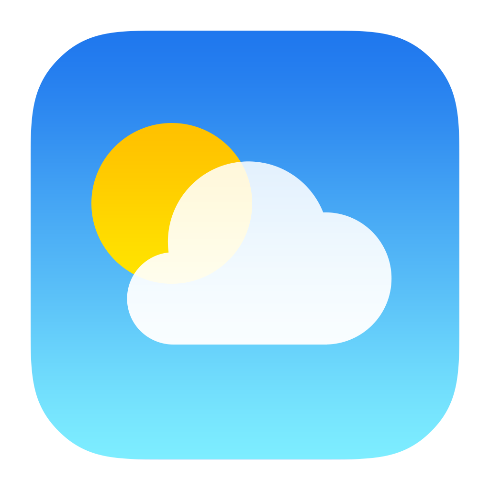

# 🌦️ WeatherCAST – Weather App

WeatherCAST is a simple and interactive weather application built using **HTML, CSS, and Vanilla JavaScript**.  
It allows users to search for any city and view **real-time weather data** using the **OpenWeatherMap API**.

---

## 🚀 Features

- 🌡️ Real-time temperature (°C)
- ☁️ Weather condition (Haze, Clouds, Rain, etc.)
- 💧 Humidity
- 🌬️ Wind speed
- 👁️ Visibility
- 📍 City & country name
- 🕒 Live time and date
- 🌙 Dynamic weather icons (day/night)
- 🔍 Search weather by city name

---

## 🛠️ Technologies Used

- **HTML5**
- **CSS3**
- **JavaScript (ES6)**
- **OpenWeatherMap API**

---

## 📷 Preview

---

## ⚙️ How It Works

1. User enters a city name in the search input.
2. The app sends a request to the OpenWeatherMap API.
3. Weather data is fetched asynchronously using `fetch()` and `async/await`.
4. The UI updates dynamically with weather details and icons.

---

## 📌 API Used
https://api.openweathermap.org/data/2.5/weather
